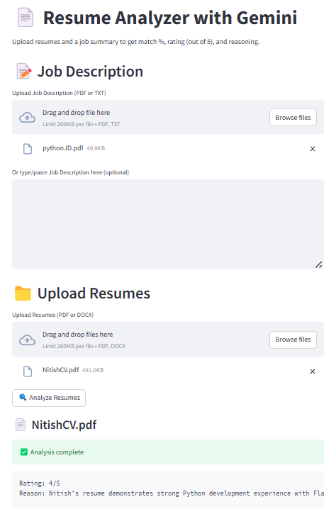

# resume-analyzer
Upload a resume + job summary → get an AI-powered match %, rating, and explanation.

# 🤖 Resume Analyzer with Gemini 1.5 Pro(Paid) or Llama3(Free) 

This is an AI-powered Resume Analyzer built using **Streamlit** and **Gemini 1.5 Pro** or **Llama3-70b-8192**. Upload a resume and a job summary (either as text or file), and get:
- A **match percentage**
- A **rating out of 5**
- A **reason** explaining the score

### 🔍 Key Features

- Upload resumes as `.pdf` or `.docx`
- Upload or paste job summaries (`.txt` or `.pdf`)
- Uses Gemini AI to evaluate candidates
- Clean, responsive UI built with Streamlit

---

## 🖥️ Demo

> Coming soon – host this on Streamlit Cloud or locally to test it!

---

## 📸 Screenshots

### 🖥️ Main UI


### ✅ Output Example


## 🚀 How to Run Locally

1. Clone the repository:

```bash
git clone https://github.com/divyam8333/resume-analyzer-gemini.git
cd resume-analyzer-gemini

2. Install dependencies: pip install -r requirements.txt

3. Set up Gemini API key: genai.configure(api_key="YOUR_API_KEY")
Replace YOUR_API_KEY in resume_analyzer_gemini.py with your actual Google AI Studio API key.
or
os.environ["GROQ_API_KEY"] = "put_groq_api_key_here"
client = Groq(api_key=os.environ["GROQ_API_KEY"])

4. Run the app: "streamlit run resume_analyzer_app.py"
